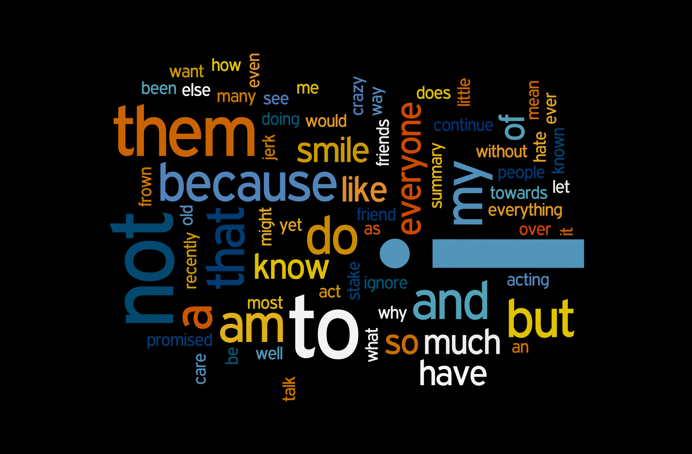

# Transfrom word2vec bin format using gensim word2vec2tensor

Convert Word2Vec.bin model to tensor TSV file, a format that can be uploaded to projector project



## Context

This is a part of an upwork project, the goal of the client is to have a visual
that can be useful to interact with word embeddings

## Input model 

The input .bin model can be downloaded from [link](http://mccormickml.com/2016/04/12/googles-pretrained-word2vec-model-in-python/)


## Calling the script from shell window

first unzip the download model file, then execute

1. EXECUTE

    ```shell
    python word2vec2tensor.py -i  GoogleNews-vectors-negative300.bin -o my_model_prefix -b
    ```

    note that the `-b` flag is to say that our file is binary

2. OUTPUT

    ```shell
    2018-11-09 14:40:09,594 - utils_any2vec - INFO - loading projection weights from GoogleNews-vectors-negative300.bin
    2018-11-09 14:45:19,817 - utils_any2vec - INFO - loaded (3000000, 300) matrix from GoogleNews-vectors-negative300.bin
    2018-11-09 15:22:28,927 - word2vec2tensor - INFO - 2D tensor file saved to my_model_prefix_tensor.tsv
    2018-11-09 15:22:29,952 - word2vec2tensor - INFO - Tensor metadata file saved to my_model_prefix_metadata.tsv
    2018-11-09 15:23:35,929 - word2vec2tensor - INFO - finished running word2vec2tensor.py
    ```

## Author

* **Hichem MAIZA**
  
## Acknoledgements

* **Google** for their great projector project
  
* **Gensim** for the great `word2vec2tensor` script

* **UPWORK** a great place to work